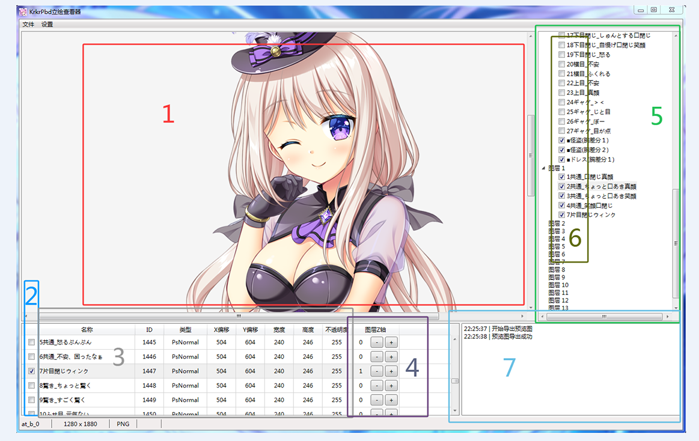

# 操作手册

## 使用准备
* Windows电脑已安装 .Net 6 运行环境
* 游戏已解包并且已还原文件名
* 立绘文件与立绘图层位于同一目录
* 软件不内置TLG解码器, 需转码到指定格式

---

## 格式支持
* 立绘文件 
&emsp;pbd
* 输入图像 
&emsp;bmp 
&emsp;png 
&emsp;webp 
&emsp;tiff/tif 
&emsp;tga 
* 输出图像 
&emsp;webp 
&emsp;png (默认) 
&emsp;bmp 
&emsp;tga 

---

## 界面操作
### 菜单栏
* 文件 
&emsp;打开 -> 打开Pbd立绘文件 
&emsp;导出 
&emsp;&emsp;预览立绘 -> 编码预览窗口内容 
&emsp;&emsp;全部立绘 -> 编码立绘合成栈已勾选图层 
* 设置 
&emsp;导出格式 -> 选择输出图像编码 
&emsp;游戏参数 -> 选择游戏Pbd加密参数 

### 状态栏
* 依次显示 
&emsp;当前立绘名 
&emsp;当前画布大小 
&emsp;当前输出格式 
&emsp;当前进度 

### 主窗口
&emsp;1. 预览窗口 -> 根据预览状态与图层级显示 
&emsp;2. 预览复选框 -> 勾选启用预览 
&emsp;3. 图层信息 
&emsp;4. 图层Z轴 -> -/+按钮切换图层级 
&emsp;5. 立绘合成栈 
&emsp;6. 合成复选框 -> 勾选参与批量合成 
&emsp;7. 日志窗口 
 

---

### 结果输出
* 预览输出 
&emsp;工具目录/Preview_Export/ 
* 合成输出 
&emsp;工具目录/Stand_Export/立绘名称/ 
